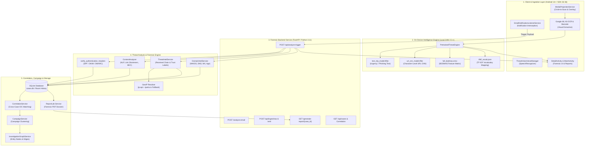

# MessageGuard — System Architecture (SIH26106)

---

### 1. High-Level Architectural Topology

---

### 2. Component Breakdown

#### A. Android Client Application (`com.messageguard`)
- **Minimum SDK:** 26 (Android 8.0 Oreo)
- **Target SDK:** 34 (Android 14 UpsideDownCake)
- **Compile SDK:** 36 (Android 15+)
- **Concurrency & Architecture:** Kotlin Coroutines (`Dispatchers.IO`, `Dispatchers.Main`), ViewBinding, Room ORM, OkHttp3 with connection pooling and 45s timeouts.
- **Forensic UI:**
  - `MainActivity.kt`: Dashboard with recent threat statistics, quick settings, QR phishing scanner, and file sandbox launcher.
  - `DetailActivity.kt`: Comprehensive forensic dossier viewer displaying risk score, SPF/DKIM/DMARC badges, interactive Leaflet/MapLibre map, hop-by-hop relay sequences, entity graphs, and local PDF export.
  - `OverlayManager.kt`: Draggable floating shield icon with quick verdict pills and Circle-to-Scan trigger.

#### B. FastAPI Backend Service (`backend/`)
- **Framework:** FastAPI 0.115 + Uvicorn ASGI server
- **Endpoints:**
  - `POST /api/analyze-trigger`: Primary notification ingestion endpoint handling direct payload or fetching RFC 822 MIME from Gmail API.
  - `POST /analyze-email`: Headless text analysis endpoint for direct message text.
  - `POST /api/ingest/raw`: Universal RFC 822 pasted raw source ingestion for Outlook, Thunderbird, and IMAP.
  - `POST /api/ingest/eml`: Universal `.eml` / `.msg` file upload ingestion.
  - `GET /generate-report/{case_id}`: Stream ReportLab-generated forensic PDF with SHA-256 seal.
  - `GET /api/cases`: Searchable case repository with configurable retention and privacy redaction.

#### C. Threat Intelligence & Domain Intelligence Services
- **`ThreatIntelService.py`:**
  - Reconstructs chronological transmission paths from top-to-bottom Received headers.
  - Assigns per-hop trust labels: `TRUSTED_RELAY`, `OBSERVED`, `SUSPICIOUS_RELAY`, `POSSIBLY_FORGED`.
  - Filters private subnets (`127.0.0.0/8`, `10.0.0.0/8`, `172.16.0.0/12`, `192.168.0.0/16`, link-local, multicast).
  - Resolves earliest reliable public IP with dual-provider fallback (`ip-api.com` primary, `ipwho.is` secondary) and in-memory caching.
- **`DomainIntelService.py`:**
  - Performs non-blocking DNS queries for MX, A, and NS records with 3-second timeouts.
  - Evaluates registrar information, creation timestamps, and newly registered domain (NRD) age (<30 days).

#### D. Storage & Data Persistence
- **On-Device:** SQLite via AndroidX Room (`analysis_history` table), storing verdict history, sender reputation, explainability spans, and risk scores.
- **Backend:** SQLite database (`cases.db`), persisting normalized indicators, cross-case correlations, campaigns, and retention schedules.
