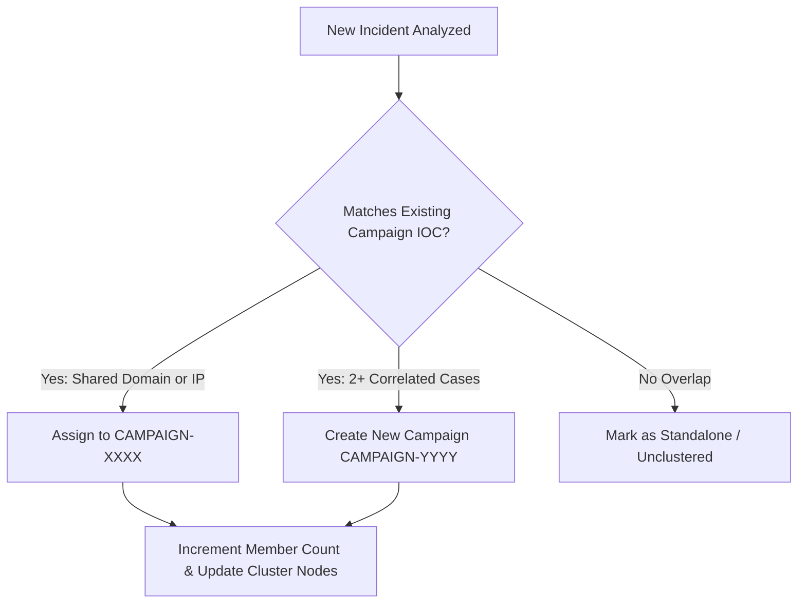

# MessageGuard — Cross-Case Correlation, Threat Campaigns & Investigation Graph (SIH26106)

---

### 1. Cross-Case Indicator Correlation Engine (`CorrelationService.py`)

In real-world phishing and Business Email Compromise (BEC) operations, adversaries reuse infrastructure across multiple targets. MessageGuard automatically cross-correlates newly ingested cases against all historical records in the SQLite database (`cases.db`).

#### Normalized Indicators of Compromise (IOCs)
Each case extracts and normalizes:
- **`sender_email`**: Standardized to lowercase.
- **`sender_domain`**: Extracted FQDN and registered apex domain.
- **`originating_ip`**: Earliest verifiable public relay IP.
- **`url_domains`**: Fully qualified domains extracted from embedded hyperlinks.
- **`attachment_hashes`**: SHA-256 digests of downloaded or extracted email attachments.

#### Attribution Support (Never Speculative Accusation)
MessageGuard assigns transparent confidence levels based on deterministic overlap:
- **HIGH Confidence:** 3 or more matching IOCs across historical incidents (e.g., identical originating IP + matching URL domain + identical fake display name).
- **MEDIUM Confidence:** 2 matching IOCs (e.g., shared apex domain and similar subject keywords).
- **LOW / INDETERMINATE:** 1 or 0 matching indicators.

> **Forensic Ethics Standard:** The correlation output is labeled **"Attribution Support: Related infrastructure observed"**, never claiming to identify the individual physical human behind the keyboard.

---

### 2. Automated Threat Campaign Clustering (`CampaignService.py`)

When multiple incidents share critical infrastructure, MessageGuard groups them into unified campaign clusters (`CAMPAIGN-XXXX`).

#### Campaign Membership Criteria


#### Persisted Campaign Schema
Each campaign stores:
- `campaign_id`: Unique identifier (e.g., `CAMPAIGN-94B2F104`)
- `campaign_name`: Behavioral label (e.g., `Cluster: fake-irs-alert.org Infrastructure`)
- `first_seen` / `last_seen`: Chronological campaign activity window.
- `member_count`: Total linked forensic cases.
- `confidence`: Calculated cluster confidence (`HIGH`, `MEDIUM`, `LOW`).

---

### 3. Investigation Graph Topology (`InvestigationGraphService.py`)

MessageGuard constructs an entity relationship graph representing the full forensic topology:

#### Graph Node Types
1. **`CASE`**: The analyzed incident root node.
2. **`SENDER`**: The email sender address (with PII masking applied in list views).
3. **`DOMAIN`**: Sender domain, MX servers, and registered nameservers.
4. **`IP`**: Observable relay MTAs and destination infrastructure nodes.
5. **`URL`**: Embedded landing URLs and shortened redirect hops.
6. **`ATTACHMENT`**: Document/binary payloads identified by SHA-256 hash.
7. **`INFRASTRUCTURE`**: Autonomous System (ASN), ISP, and cloud hosting provider.
8. **`CAMPAIGN`**: Associated campaign cluster.

#### Graph Edge Relationships
- `CASE` — `SENT_BY` —> `SENDER`
- `SENDER` — `USES_DOMAIN` —> `DOMAIN`
- `CASE` — `ROUTED_THROUGH` —> `IP`
- `IP` — `OPERATED_BY` —> `INFRASTRUCTURE`
- `CASE` — `CONTAINS_URL` —> `URL`
- `CASE` — `HAS_ATTACHMENT` —> `ATTACHMENT`
- `CASE` — `MEMBER_OF_CAMPAIGN` —> `CAMPAIGN`

---

### 4. Graph Visualization in Android UI

In [DetailActivity.kt](file:///c:/POC2/MessageGuard/app/src/main/java/com/messageguard/DetailActivity.kt), the entity relationship graph is rendered directly in the **Campaign & Relationship Graph Card**:

```text
CASE: MG-BBE826BA
 ├── ORIGIN: 209.85.220.41 (Mountain View, California, United States)
 ├── DOMAIN: fake-irs-alert.org
 ├── AUTH: DOMAIN_UNAUTHORIZED (SPF:SOFTFAIL DKIM:UNKNOWN DMARC:FAIL)
 ├── VERDICT: UNVERIFIED (Risk Score: 40%)
 └── CAMPAIGN: Cluster: fake-irs-alert.org Infrastructure (2 Linked Cases)
```
Topology metrics (e.g., `Graph Topology: 6 Entity Nodes, 5 Forensic Edges`) are displayed, giving investigators immediate structural insight into the threat.
