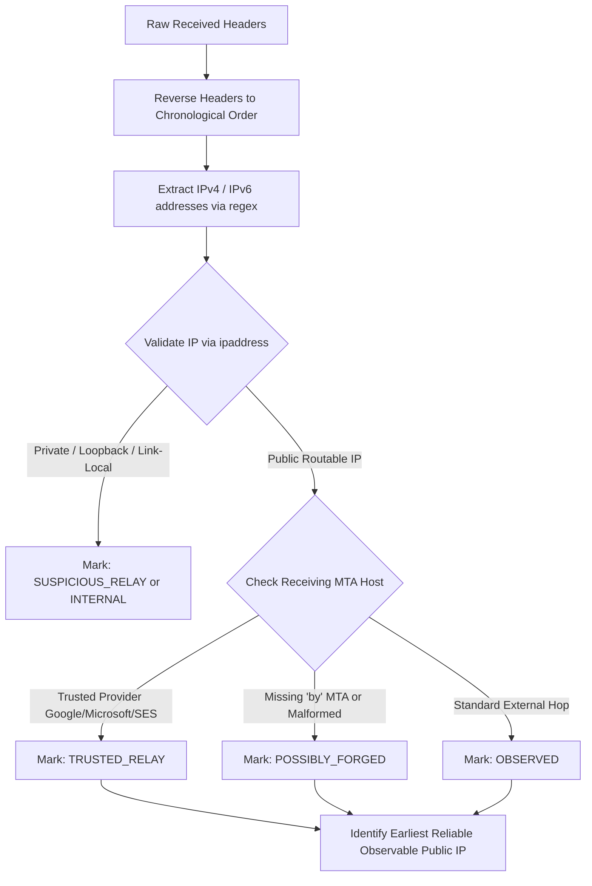

# MessageGuard — Forensic Header Analysis & Approximate Geolocation (SIH26106)

---

### 1. Email Header Extraction & Provenance Reversal

RFC 5322 and RFC 822 specify that mail transfer agents (MTAs) prepend a `Received:` header to the top of the email as it traverses intermediate mail servers.

#### The Inversion Trap
- **Topmost Header:** Represents the final hop received by the user's provider (e.g., `mx.google.com` or local corporate exchange). Naive parsers often extract this IP, resulting in false attribution to Google, Microsoft, or internal relays.
- **Bottommost Header:** Represents the earliest transmission recorded. However, forged or spoofed emails can inject arbitrary untrusted fake Received headers at the bottom.

#### Chronological Reconstruction Algorithm
MessageGuard implements an evidence-based parser in `ThreatIntelService.build_relay_chain()`:



---

### 2. Private IP Validation & Handling

Before querying any external GeoIP registry, MessageGuard validates the candidate IP using Python's standard `ipaddress` library:

- **Loopback:** `127.0.0.0/8`, `::1`
- **RFC 1918 Private Ranges:**
  - `10.0.0.0/8` (`10.0.0.0` - `10.255.255.255`)
  - `172.16.0.0/12` (`172.16.0.0` - `172.31.255.255`)
  - `192.168.0.0/16` (`192.168.0.0` - `192.168.255.255`)
- **Link-Local & Multicast:** `169.254.0.0/16`, `224.0.0.0/4`, `fe80::/10`
- **Carrier-Grade NAT & Documentation:** `100.64.0.0/10`, `198.51.100.0/24`, `203.0.113.0/24`

#### Policy on Non-Global IPs
1. **Never Queried:** Never sent to external geolocation APIs, preventing API leakage and rate-limit waste.
2. **Clear UI Explanation:** Renders *"Private / Non-Global IP — Geolocation unavailable for internal network addresses."*
3. **Never Treated as Malicious:** Private IPs frequently occur in enterprise intranet routing; they are classified as evidence incompleteness, NOT high threat risk.

---

### 3. Dual-Provider Geolocation & In-Memory Caching

To guarantee 100% demo reliability and avoid rate limiting (such as `ip-api.com`'s free tier cap of 45 requests/minute):

1. **In-Memory Cache (`_geoip_cache`):** Fast dictionary cache keyed by normalized IP address. Repeated lookups within or across cases resolve in 0 ms.
2. **Primary Provider:** `http://ip-api.com/json/{ip}?fields=...` (timeout: 4 seconds).
3. **Automatic Fallback Provider:** `https://ipwho.is/{ip}` (free, reliable, high throughput, returns ISP, ASN, country, city, coordinates).
4. **Normalized Output Schema:**
```json
{
  "ip": "209.85.220.41",
  "city": "Mountain View",
  "region": "California",
  "country": "United States",
  "country_code": "US",
  "lat": 37.3861,
  "lon": -122.084,
  "isp": "Google LLC",
  "org": "Google LLC",
  "asn": "AS15169 Google LLC",
  "classification": "DATACENTER_CLOUD",
  "disclaimer": "Approximate infrastructure geolocation based on IP registry data. This does NOT establish the sender's physical location."
}
```

---

### 4. Interactive Map Visualization & Honest Presentation

#### Interactive Tile Map (`DetailActivity.kt`)
Coordinates are rendered using an embedded Leaflet/OpenStreetMap tile view inside an Android `WebView`:
- **Coordinate Order:** `[Latitude, Longitude]` in UI / Leaflet; `[Longitude, Latitude]` in GeoJSON.
- **Marker Title:** **"Observed Network Infrastructure"**
- **Accuracy Buffer:** A 25km radius circle is drawn around the coordinate to visually indicate that the location represents a city-level ISP/hosting facility, not an exact house or building.

#### Mandatory Forensic Disclaimer
Every screen, PDF report, and case summary contains the explicit notice:
> *"IMPORTANT: Location represents the approximate network infrastructure associated with the observed IP address. It does not establish the sender's exact physical location or identity."*
