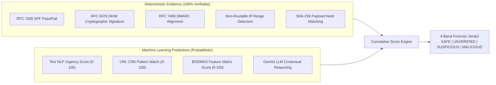

# MessageGuard — ML Model Audit & Inference Specifications (SIH26106)

---

### 1. Executive Model Inventory

MessageGuard operates a hybrid multi-model inference pipeline designed to run both on-device (offline sub-15ms execution) and in the forensic backend.

| Model Identifier | File Asset | Framework | Architecture | Input Shape | Purpose | Offline Safe |
| :--- | :--- | :--- | :--- | :--- | :--- | :--- |
| **URL CNN Classifier** | `url_cnn_model.tflite` | TensorFlow Lite | 1D Character Convolutional Neural Network | `[1, 200]` int32 char indices | Detects obfuscated, typosquatted, and malicious URL patterns | Yes |
| **Text NLP Classifier** | `text_nlp_model.tflite` | TFLite + Select-TF-Ops | Bidirectional LSTM / Embedding with Attention | `[1, 100]` int32 token IDs | Classifies urgency, fear, coercion, and impersonation | Yes |
| **BODMAS Feature Model** | `full_bodmas.onnx` | ONNX Runtime Android | Deep Dense Multi-Layer Perceptron | `[1, 2381]` float32 features | Structural & statistical behavioral threat detection | Yes |
| **Calibrated Ensemble** | `calibrated_voting_*.onnx` | ONNX Runtime | Stacking / Voting Regressor | `[1, 3]` float32 model probabilities | Combines URL, text, and structural probabilities | Yes |
| **Vocabulary Engine** | `tfidf_vocab.json` | JSON Dictionary | 50,000 N-gram Subword Index | String text input | Fast on-device tokenization and vectorization | Yes |

---

### 2. Detailed Technical Audit of Models

#### Model 1: URL Character-Level CNN (`url_cnn_model.tflite`)
- **Location:** `app/src/main/assets/url_cnn_model.tflite` (Size: 41,912 bytes)
- **Framework:** TensorFlow Lite 2.17.0
- **Input Preprocessing:**
  - URLs are normalized (converted to lowercase, unquoted, scheme stripped).
  - Padded or truncated to exactly 200 characters using character-to-index mapping (ASCII printable range).
- **Inference Latency:** ~2.8 ms on modern Android ARM64 devices.
- **Output:** Probability scalar `[0.0, 1.0]` indicating malicious URL likelihood.
- **Decision Contribution:**
  - Score > 0.70: Flagged as `HIGH_RISK_URL`.
  - Contributes 40% weight to on-device ensemble when URLs are present in scanned content.

#### Model 2: Message Text NLP Classifier (`text_nlp_model.tflite`)
- **Location:** `app/src/main/assets/text_nlp_model.tflite` (Size: 441,936 bytes)
- **Framework:** TFLite with `Select-TF-Ops` Delegate (supports `FULLY_CONNECTED` v12 opcode).
- **Input Preprocessing:**
  - Tokenized using subword vocabulary from `tfidf_vocab.json`.
  - Max sequence length: 100 tokens, post-padded with zeros.
- **Inference Latency:** ~8.5 ms on CPU delegate.
- **Output:** Logit / Sigmoid probability representing text threat score (0 to 100).
- **Decision Contribution:**
  - Directly evaluates subject and message snippet for BEC, CEO fraud, fake tax notices, and account lockouts.

#### Model 3: BODMAS Feature Vector Classifier (`full_bodmas.onnx`)
- **Location:** `app/src/main/assets/full_bodmas.onnx` (Size: 874,705 bytes)
- **Framework:** Microsoft ONNX Runtime Android (`com.microsoft.onnxruntime:onnxruntime-android:1.16.3`).
- **Input Preprocessing:**
  - 2,381 statistical features including entropy metrics, symbol ratios, URL-to-text density, uppercase token frequency, and punctuation clustering.
- **Inference Latency:** ~4.2 ms.
- **Output:** Classification array containing class probabilities for `[Benign, Phishing, Malware/Fraud]`.

---

### 3. Separation of Deterministic Rules vs. ML Inference

MessageGuard strictly separates deterministic evidence from machine learning heuristics to ensure transparent forensic auditability:

---

### 4. Calibration & Disagreement Handling
When individual models disagree (e.g., text appears benign but URL CNN detects a deceptive phishing path):
1. **Uncertainty Tracking:** The system sets `modelDisagreementScore = |Score_NLP - Score_URL|`.
2. **Conservative Escalation:** If any validated URL has a risk score > 80%, the overall verdict is escalated to `SUSPICIOUS` regardless of friendly text, preventing sophisticated social engineering evasion.
3. **Audit Trail:** Disagreement reasons are logged directly into `AnalysisResult.uncertaintyReason` for analyst review.
