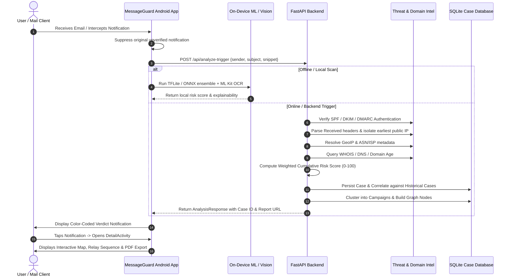

# MessageGuard — Project Overview & Workflow (SIH26106)

### 1. Problem Statement Background (SIH26106)
**Official Title:** *AI-Powered Email Threat Detection, GeoLocation and Forensic Intelligence Platform*  
**Problem Statement ID:** **SIH26106**  
**Category:** Cybersecurity / Artificial Intelligence / Digital Forensics

Modern email security faces critical evasion techniques that bypass legacy spam filters:
1. **Spear Phishing & BEC (Business Email Compromise):** Highly personalized messages without generic spam keywords, often requesting urgent financial transfers or credential verifications.
2. **Infrastructure Masking:** Attackers bouncing emails through multiple legitimate relay servers (e.g., SendGrid, Google Workspace, compromised mail relays), making naive origin detection extract the wrong hop.
3. **Multi-Vector Delivery:** Attackers targeting users across Gmail, Outlook, mobile messengers, and QR codes printed in PDFs or displayed on screens.
4. **False Sense of Precision:** Legacy geolocation tools often mislead investigators by claiming an IP's location is the physical street address of the perpetrator, rather than an approximate ISP network transit node.

MessageGuard addresses these challenges with an integrated on-device Android security layer, a centralized forensic backend, and deterministic relay-chain analysis.

---

### 2. Target User Personas & Use Cases

#### A. Enterprise Security Analysts & Incident Responders
- **Need:** Comprehensive forensic investigation dossiers, correlation with prior security cases, visual relay route maps, and campaign clustering.
- **Workflow:** Export tamper-evident PDF dossiers containing cryptographic SHA-256 hashes, review domain age via WHOIS/DNS, and inspect entity relationship graphs.

#### B. End Users & Mobile Workers
- **Need:** Real-time protection while reading emails in native apps (Gmail, Outlook, Yahoo Mail) without interrupting normal phone use.
- **Workflow:** Automatic notification suppression of untrusted emails, floating security bubble with Circle-to-Scan, and plain-language threat explanations.

#### C. Law Enforcement & Forensic Investigators
- **Need:** Objective evidence separation: confirmed evidence (cryptographic auth, observable hops) vs. probable assessment (NLP intent scores) vs. unknown/indeterminate (physical perpetrator identity).
- **Workflow:** Reconstruct chronological Received-header chains with verifiable timestamps, identifying the earliest verifiable public IP without speculative guessing.

---

### 3. Core Architectural Workflow

---

### 4. Key Security & Privacy Safeguards
1. **No Device GPS Usage:** The platform strictly derives geolocation from email header evidence and public routing registries; device GPS is never accessed for email geolocation.
2. **Approximate Infrastructure Disclaimer:** Every UI card, notification, and PDF explicitly emphasizes that geolocation reflects the sender's network ISP/datacenter transit node, not physical home address.
3. **Zero Malicious Attribution on Private IPs:** Emails originating within private subnets (`10.0.0.0/8`, `192.168.0.0/16`, `127.0.0.0/8`) are clearly marked as internal transit and are never treated as inherently malicious.
4. **Configurable Data Retention & PII Masking:** Case retention defaults to 90 days with automatic scheduled purging; sensitive personal data is redacted from normal logs.
