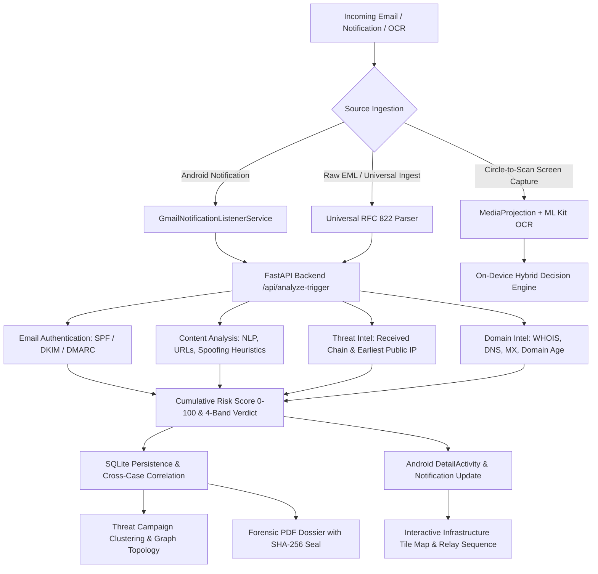

# MessageGuard — SIH26106
## AI-Powered Email Threat Detection, GeoLocation and Forensic Intelligence Platform

[](https://www.sih.gov.in)
[](https://www.sih.gov.in)
[](#)

---

### Executive Overview
**MessageGuard** is a comprehensive, production-grade cybersecurity platform engineered specifically for **Smart India Hackathon Problem Statement SIH26106** (*"AI-Powered Email Threat Detection, GeoLocation and Forensic Intelligence Platform"*).

MessageGuard provides defense-in-depth protection against modern email threats, including:
- **Spear Phishing & Deceptive URLs** (URL CNN + Link Shortener Resolution)
- **Business Email Compromise (BEC) & Financial Fraud** (Urgency & Authority NLP Classifiers)
- **Domain Spoofing & Cryptographic Failures** (RFC 7208 SPF, RFC 6376 DKIM, RFC 7489 DMARC Alignment)
- **Header Forgery & Relay Anomalies** (Chronological RFC 822 Received-Header Reconstruction)
- **Infrastructure Geolocation & AS Profiling** (Autonomous System, ISP, and Cloud Provider Resolution)
- **Interactive Forensic Visualization** (MapLibre/Leaflet Infrastructure Maps & Investigation Graphs)
- **Cryptographic Chain of Custody** (SHA-256 Content Hashing & Tamper-Evident Dossier Export)

---

### Documentation Suite (`docs/`)
For evaluation and deployment documentation, see:

1. [**Project Overview & Workflow**](PROJECT_OVERVIEW.md) — Problem background, user personas, high-level architecture.
2. [**Architecture & System Design**](ARCHITECTURE.md) — Comprehensive Android & Backend system topology and sequence flows.
3. [**ML Model Audit & Inference**](ML_MODEL_AUDIT.md) — On-device TFLite models, ONNX engines, TF-IDF vectorization, thresholds.
4. [**Email Forensics & Geolocation**](FORENSICS_AND_GEOLOCATION.md) — Header reconstruction, earliest reliable public IP extraction, GeoIP telemetry.
5. [**Graph, Correlation & Campaigns**](CORRELATION_AND_GRAPH.md) — Graph topologies, shared IOC clustering, campaign aggregation.
6. [**SIH26106 Requirements Matrix**](SIH26106_REQUIREMENTS_MATRIX.md) — Detailed compliance mapping across all hackathon evaluation criteria.
7. [**Deployment & Configuration Guide**](DEPLOYMENT.md) — Android APK compilation, environment variables, FastAPI backend deployment.

---

### Key Capabilities Matrix

| Vector | MessageGuard Capability | Implementation Engine |
| :--- | :--- | :--- |
| **Notification Guard** | Suppresses unverified email alerts; replaces with color-coded risk assessment | `GmailNotificationListenerService` |
| **Visual Threat Capture** | Interactive floating bubble & gesture crop for on-screen email scanning | `Circle-to-Scan` + Google ML Kit OCR |
| **Voice Threat Assistant** | Hands-free voice commands via Android SpeechRecognizer | `ThreatVisionVoiceManager` |
| **On-Device Inference** | Sub-15ms offline neural classification with zero data leakage | TFLite (`url_cnn`, `text_nlp`) + ONNX (`BODMAS`) |
| **Header Forensics** | Full multi-hop relay parsing with trust labels (`TRUSTED`, `OBSERVED`, `SUSPICIOUS`) | `ThreatIntelService.build_relay_chain()` |
| **Infrastructure Geolocation** | Resolves earliest verifiable external IP with GeoIP fallback & caching | `ip-api.com` + `ipwho.is` fallback |
| **Interactive Tile Map** | Visualizes observed transit node coordinates with strict disclaimers | MapLibre / Leaflet Tile WebView |
| **Cryptographic Reports** | Tamper-evident PDF export with SHA-256 evidence sealing | ReportLab PDF + Android `PdfDocument` |
| **Privacy Protection** | Configurable data retention, PII masking, local Room DB persistence | `AnalysisRepository` + Privacy Engine |

---

### Core Architecture Flow



---

### Quick Start & Verification

#### 1. Backend Service
```bash
cd backend
python -m venv venv
venv\Scripts\activate
pip install -r requirements.txt
python -m uvicorn main:app --host 0.0.0.0 --port 8000
```
Health Check:
```bash
curl http://localhost:8000/health
```

#### 2. Android Application
Open the [MessageGuard](file:///c:/POC2/MessageGuard) folder in Android Studio (Giraffe / Iguana / Koala) or build via Gradle:
```powershell
cd MessageGuard
.\gradlew.bat assembleDebug
```
Output APK: `app/build/outputs/apk/debug/app-debug.apk`

---
*Developed for Smart India Hackathon 2026 — Problem Statement SIH26106.*
